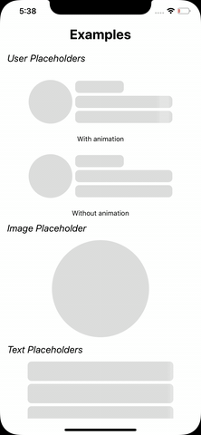
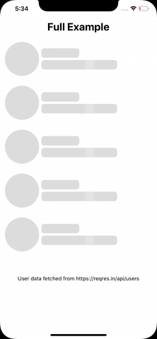

# react-native-light-placeholder

Lightweight and customizable placeholder component for React Native.

Examples            |  Full Example
:-------------------------:|:-------------------------:
| 


## Installation
```
npm i react-native-light-placeholder
```

### Usage

#### Simple
``` js
import { Placeholder, Rectangle } from 'react-native-light-placeholder';

const MyPlaceholder = props => {
    return (
        <Placeholder {...props}>
            <Rectangle />
        </Placeholder>
    )
}

//Use this component anywhere like this
<MyPlaceholder number={5} />

```

#### The codes of the above examples are here

``` js
import React from 'react';
import {
  SafeAreaView,
  StyleSheet,
  ScrollView,
  Text,
} from 'react-native';

import { Placeholder, Row, Circle, Col, Rectangle } from 'react-native-light-placeholder';

const ImagePlaceholder = props => {
    return (
        <Placeholder {...props}>
            <Circle diameter={200} />
        </Placeholder>
    )
}

const TextPlaceholder = props => {
    return (
        <Placeholder {...props}>
            <Rectangle width={300} height={40} />
        </Placeholder>
    )
}

const UserPlaceholder = props => {
    return (
        <Placeholder {...props} style={{alignSelf:'center'}}>
            <Row style={{marginVertical:20}}>
                <Circle />
                <Col>
                    <Rectangle width={100} />
                    <Rectangle />
                    <Rectangle />
                </Col>
            </Row>
        </Placeholder>
    )
}

const Example1Placeholder = props => {
    return (
        <Placeholder {...props} style={{alignSelf:'center'}}>
            <Row style={{marginVertical:20,alignItems:'center'}}>
                <Rectangle square height={60} />
                <Col>
                    <Rectangle width={100} />
                    <Rectangle />
                </Col>
            </Row>
        </Placeholder>
    )
}


const Example2Placeholder = props => {
    return (
        <Placeholder {...props} style={{alignSelf:'center'}}>
            <Row>
                <Col>
                    <Rectangle />
                    <Rectangle />
                </Col>
                <Circle diameter={60}/>
            </Row>
        </Placeholder>
    )
}

//Usage

const App = () => {
  const  [visible,setVisible] = React.useState(true);

  return (
    <SafeAreaView >
      <ScrollView>
        <Text style={styles.title}>Examples</Text>

        <Text style={styles.subtitle}>User Placeholders</Text>
        
        <UserPlaceholder number={1} visible={visible} />
        <Text style={{textAlign:'center'}}>With animation</Text>

        <UserPlaceholder animated={false} number={1} visible={visible} />
        <Text style={{textAlign:'center'}}>Without animation</Text>

        <Text style={styles.subtitle}>Image Placeholder</Text>
        <ImagePlaceholder visible={visible} />

        <Text style={styles.subtitle}>Text Placeholders</Text>
        <TextPlaceholder visible={visible} number={10} />

        <Text style={styles.subtitle}>Another Examples</Text>
        
        <Example1Placeholder visible={visible} number={2}  />
        <Example2Placeholder visible={visible} number={2}  />

      </ScrollView>
    </SafeAreaView>
  );
};

const styles = StyleSheet.create({
  title:{
    fontSize:28,
    fontWeight:'bold',
    textAlign:'center',
    padding:10
  },
  subtitle:{
    fontSize:20,
    textAlign:'left',
    padding:10,
    marginLeft:5,
    fontStyle:'italic'
  }
});

export default App;

```

Full example see [this](https://github.com/metehankurucu/react-native-light-placeholder/blob/master/examples/example.js)

### Props

| Prop | Description | Type | Default |
|---|---|---| ---|
|**`visible`**| visible of placeholder component | boolean |false|
|**`animated`**| animation of placeholder | boolean |true|
|**`duration`**|Duration of animaton lap| number |800|
|**`number`**|number of placeholders | number |1|


### License

[MIT](https://github.com/metehankurucu/react-native-light-placeholder/blob/master/LICENSE)
